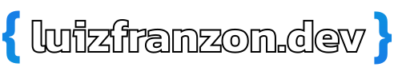

<div id="top"></div>

<!-- PROJECT LOGO -->
<br />
<div align="center">
  <a href="https://github.com/luizfranzon/portfolio">
    
  </a>

<h3 align="center">Portfolio</h3>

<p align="center">
    My portfolio where I talk a little about myself and my projects.
</p>

</div>

<br>

<!-- ABOUT THE PROJECT -->

<!-- ## About the project: -->

<!--  -->

<!-- ### Built With -->

<!-- -   [React](https://pt-br.reactjs.org/)
-   [react-reveal](https://www.react-reveal.com/)
-   [typed.js](https://github.com/mattboldt/typed.js/) -->

<!-- GETTING STARTED -->

## Getting Started

**1- Clone this repository:**

```bash
git clone https://github.com/luizfranzon/portfolio.git
```

**2- Install dependencies:**

```bash
yarn
```

**3- Run the server:**

```bash
yarn dev
```


<!-- ROADMAP -->

<p align="right">(<a href="#top">back to top</a>)</p>
<a href="https://gitmoji.dev">
  
</a>
